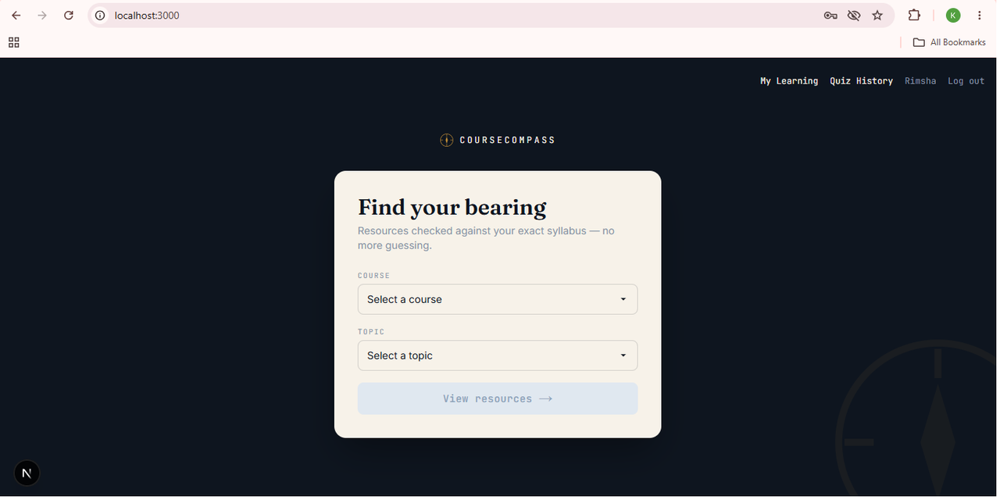
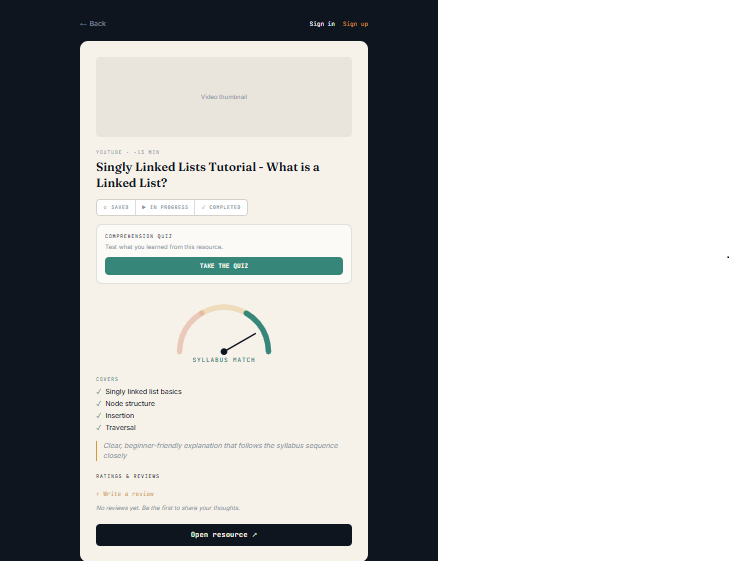
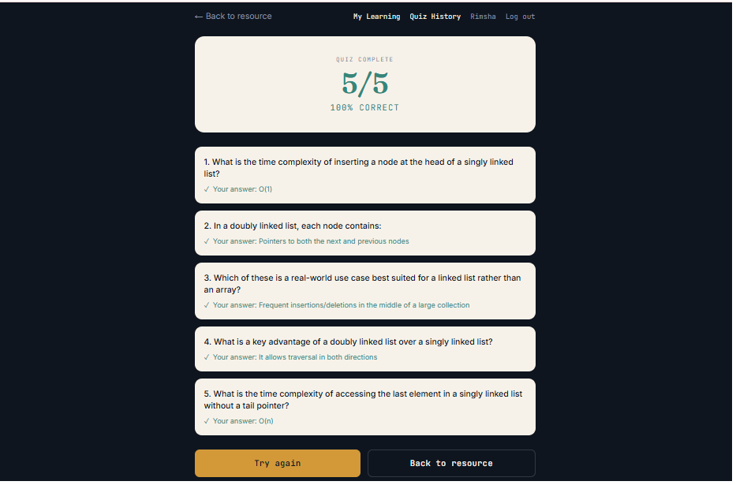
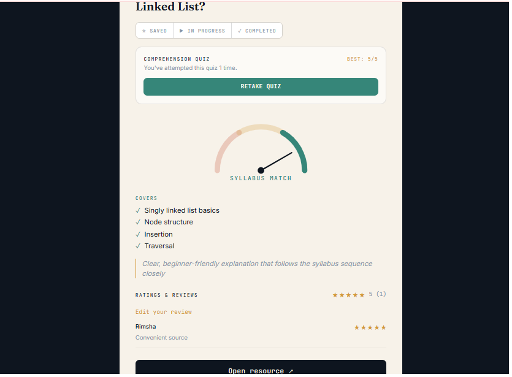
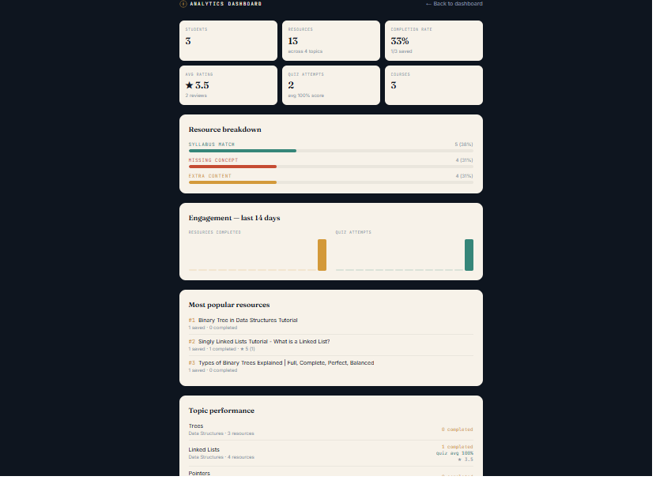
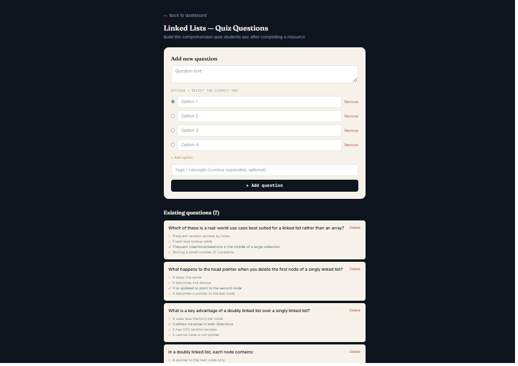

# CourseCompass

> Find learning resources that actually match your syllabus — then prove you understood them.

**Live app:** https://course-compass-inno-viast.vercel.app  
**API:** https://coursecompass-innoviast.onrender.com  
**Repository:** https://github.com/khadija6415/CourseCompass-InnoViast

---

## The problem

CS students spend hours hunting for YouTube tutorials that actually match what their course syllabus covers — most search results are either too basic, too advanced, or cover the wrong sub-topics entirely. There's no way to know if a video is worth 40 minutes of your time before you watch it.

## The solution

CourseCompass lets a student pick their course and topic, then see curated video resources automatically tagged against the syllabus:

- ✅ **Syllabus match** — covers exactly what the course requires
- ➕ **Extra content** — useful but goes beyond the syllabus
- ❌ **Missing concept** — the syllabus requires this but no resource covers it yet

Students can also upload their own syllabus PDF or paste syllabus text, and the platform re-ranks resources by how well they personally match it.

## Who it's for

CS students (starting with Superior University's DSA/OOP-level courses) who want to stop guessing which YouTube video is actually worth watching.

---

## Week 6 enhancements

Week 5 shipped the core MVP (syllabus matching, resource browsing, bookmarks, admin panel). Week 6 adds four enhancements that turn passive browsing into an active learning loop:

| Feature | What it does |
|---|---|
| **Progress Tracking & Comprehension Quiz** | Students mark resources Saved → In Progress → Completed, see per-topic completion %, and take a short quiz (auto-assembled from admin-authored questions tagged to that topic) after finishing a resource. Quiz history with marks is saved. |
| **Ratings & Reviews** | Students leave a 1–5 star rating and comment on any resource; average rating and review count show on every resource card. |
| **Analytics Dashboard** | Admin-only view: platform-wide stats, resource popularity, per-topic completion/quiz/rating performance, and a 14-day engagement trend — all computed from real usage data, no separate tracking pipeline. |
| **Auth & Security Hardening** | Fixed a registration hole that let any user self-assign the admin role; added short-lived access tokens + rotating refresh tokens (so sessions survive longer without re-login, but a leaked token expires fast); added rate limiting on login/register to slow brute-force attempts. |

---

## Tech stack

| Layer | Technology |
|---|---|
| Frontend | Next.js 15 (App Router), Tailwind CSS |
| Backend | Node.js, Express, MongoDB Atlas (Mongoose) |
| Auth | JWT (access + refresh tokens), bcrypt |
| File processing | Multer (uploads), pdf-parse (syllabus text extraction) |
| Deployment | Vercel (frontend), Render (backend) |

---

## Architecture notes

- **Data model:** `Course → Topic → Resource` hierarchy. `Bookmark` doubles as the progress tracker (`status`: saved / in-progress / completed). `Review` and `Question`/`QuizAttempt` are independent collections keyed to `Resource`/`Topic`, so each feature can be reasoned about — and demoed — on its own.
- **Auth flow:** Login/register issue a 15-minute access token + a 30-day refresh token (hashed with bcrypt before storage, rotated on every refresh). The frontend's `apiFetch` wrapper transparently retries a request once with a refreshed token on a 401, so sessions feel persistent without ever exposing a long-lived token on the wire more than necessary.
- **Analytics:** Deliberately built as MongoDB aggregation queries over existing collections (bookmarks, reviews, quiz attempts) rather than a separate event-tracking system — keeps the data model simple and the numbers always consistent with what students actually see.
- **Quiz generation:** Questions are tagged by `Topic`; when a student requests a quiz for a resource, the backend pulls all questions for that resource's topic and serves 5 at random — no AI dependency, fully admin-controlled content.

---

## Getting started locally

### Backend
```bash
cd backend
npm install
# create a .env file — see below
npm run dev
```

### Frontend
```bash
cd frontend
npm install
npm run dev
```

### Environment variables (backend `.env`)

PORT=5050
MONGO_URI=<your MongoDB Atlas connection string>
JWT_SECRET=<random string>
JWT_REFRESH_SECRET=<random string>


---
## Screenshots

**Student experience**

| | |
|---|---|
|  |  |
| Course/topic selection | Progress tracking + quiz card |
|  |  |
| Comprehension quiz score | Ratings & reviews |

**Admin experience**

| | |
|---|---|
|  |  |
| Analytics dashboard | Quiz question bank |

Full set of 17 screenshots (signup through admin analytics) is in [`/screenshots`](./screenshots).
---

## What we learned

- User testing (Week 5) surfaced that students wanted a quick visual signal for *why* a resource was tagged "extra" or "missing" — led to the per-topic ✓/✕ concept breakdown on resource cards.
- Building the quiz as an extension of Progress Tracking (rather than a separate feature) kept the data model simpler and gave a stronger product narrative: we validate learning, not just watch-time.
- Keeping analytics purely aggregation-based (no new tracking collection) meant one less thing that could drift out of sync with what users actually see.

## Roadmap

See [ROADMAP.md](./ROADMAP.md) for the full Must Have / Later breakdown with rationale.

## AI usage

See [AI_USAGE.md](./AI_USAGE.md) for a transparent account of how AI tools were used during development.