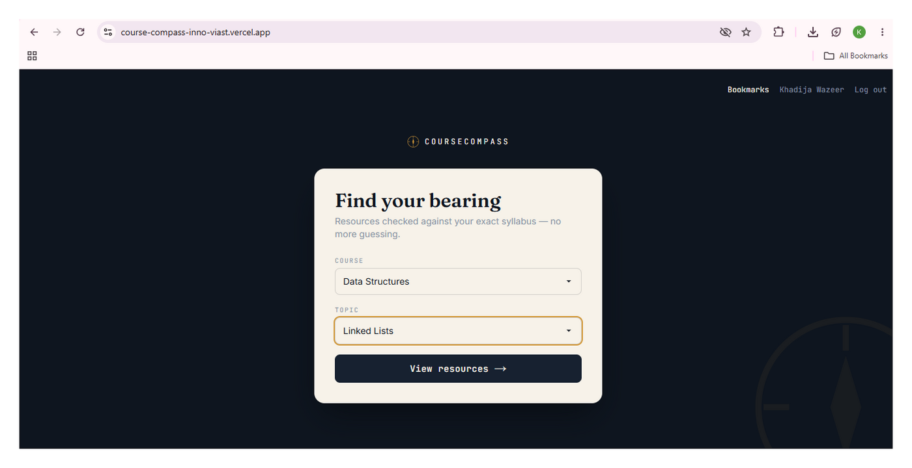
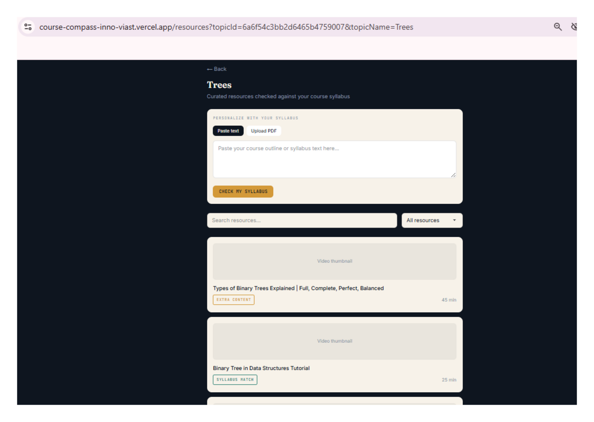
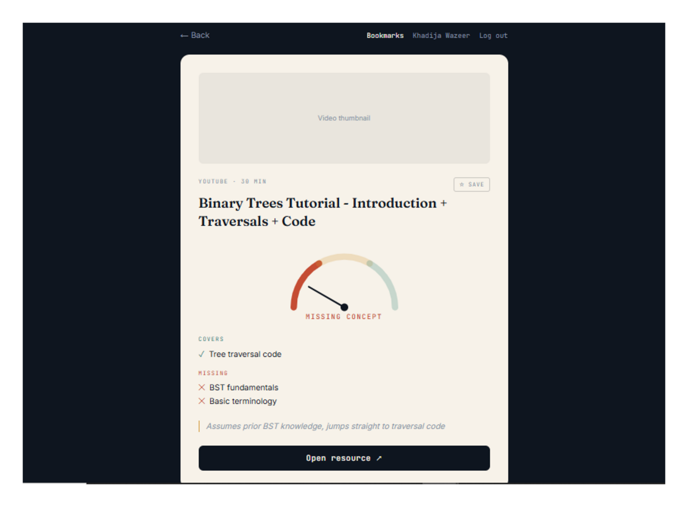
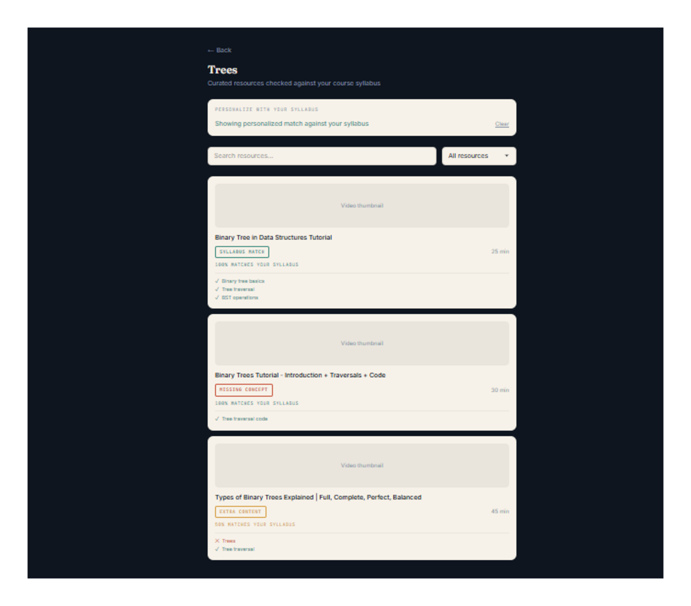
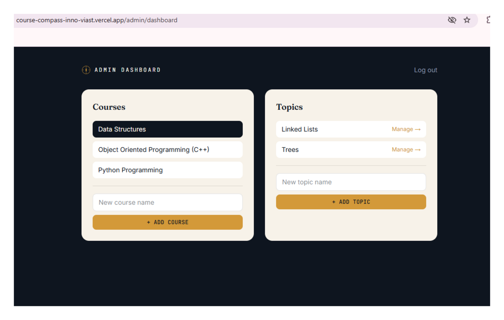
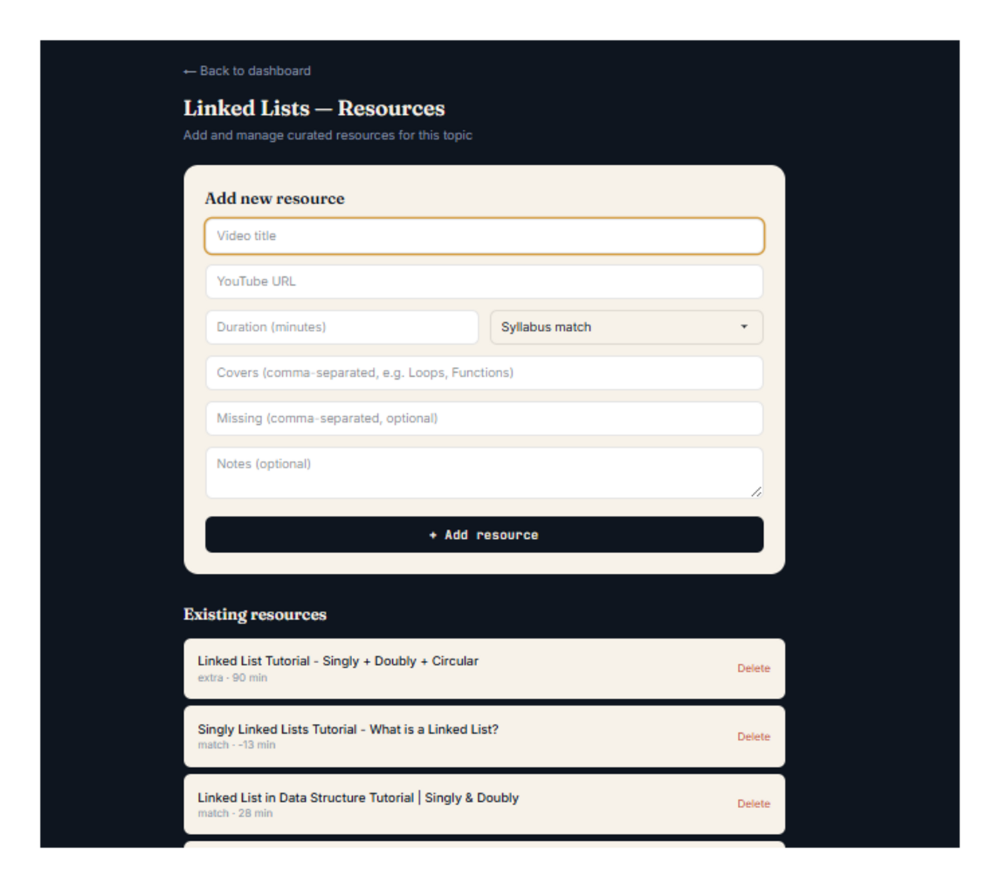
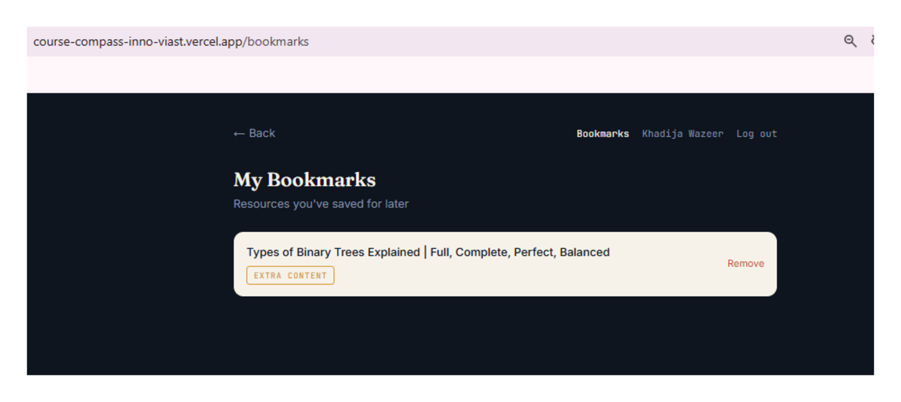

# CourseCompass

**Find learning resources that actually match your syllabus.**

CourseCompass helps computer science students stop wasting hours sifting through YouTube tutorials that either bury the actual topic under irrelevant content, or skip the exact concept the syllabus requires. Students pick their course and topic and instantly see curated resources tagged as a syllabus match, extra content, or missing a concept — with an optional personalized check against their own uploaded syllabus.

**Live app:** https://course-compass-inno-viast.vercel.app
**Repository:** https://github.com/khadija6415/CourseCompass-InnoViast
**Backend API:** https://coursecompass-innoviast.onrender.com

Built as Week 5 of the InnoViast Full-Stack Product Engineering internship track — an Innovation Discovery and MVP Sprint.

---

## The Problem

BSCS students routinely turn to YouTube and other free resources to supplement lectures — especially for programming languages like Python, C++, and core CS courses like Data Structures. This creates a recurring, frustrating pattern:

- **Extra irrelevant content**: A 10-minute concept gets buried inside a 40-minute video padded with sponsor segments, tangents, or unrelated examples.
- **Missing concepts**: A resource only covers the basic or advanced end of a topic, skipping the exact middle section the course syllabus requires — leaving gaps that surface later in assignments or exams.

The result: students burn hours watching multiple videos just to piece together what one well-matched resource could have taught them directly.

## Target User

**The Self-Supplementing CS Student** — a BSCS student (2nd–3rd year) who attends lectures but regularly turns to online video content for topics that need reinforcement, usually late at night before a deadline or exam, working alone with limited time to vet whether a resource actually fits their syllabus before committing to watching it.

## Validation Evidence

The problem was validated through structured interviews with three CS students (covering both a general study/job-search discovery phase and a focused follow-up on the specific YouTube-supplementing pain point), plus the founder's own recurring experience learning Python, C++, and core CS topics via online resources.

**Key evidence:**
- All interviewees independently described the same two failure modes: excess irrelevant content, and skipped concepts that don't match their syllabus sequence.
- All had already developed informal coping habits (checking video comments for "this part is missing" notes, cross-referencing notes side-by-side with videos, preferring short segmented videos over long ones) — a strong signal of an unmet, validated need rather than a hypothetical one.

Full discovery notes and the problem/persona definition are documented separately in the Validation Pack.

## Post-Launch Validation (Usability Testing)

The deployed MVP was tested live with two users (Aysha and Sajal), each completing an unassisted 4-task script covering the full core flow. Both independently — without seeing each other's feedback — requested the same improvement: a topic-by-topic breakdown of what a resource covers versus what it's missing, not just a match percentage.

**Change shipped in response:** Resource cards now show a ✓ / ✕ breakdown of each covered topic against the student's uploaded syllabus, visible without an extra click. Full testing notes are in `MVP_Testing_Results.md`.

---

## Features

### Must-have (core flow)
- Course and topic selection
- Curated resource list per topic, with search and filter by match status
- Each resource tagged: **Syllabus match** / **Extra content** / **Missing concept**
- Resource detail page with a match-status gauge and a covers/missing topic breakdown
- Full loading, empty, and error states throughout
- Fully responsive layout

### Should-have (added depth)
- JWT authentication (signup/login)
- Bookmarks — students save resources to revisit later
- Admin panel — login-protected dashboard to manage courses, topics, and resources without touching code
- **Syllabus Upload & Match** — students paste their course outline or upload a PDF; the system extracts keywords and computes a personalized match percentage and topic-level breakdown for every resource in that topic, without any external AI API

### Explicitly out of scope (documented, not overlooked)
- Automated AI/YouTube scraping to discover resources (curation is intentionally human-reviewed for quality and reliability)
- A full multi-subject catalog beyond the three demo courses (Data Structures, OOP/C++, Python)
- A native mobile app
- Per-topic progress tracking and community-submitted resources (noted as roadmap items, not built for MVP)

This scope decision kept the MVP focused on solving the core matching problem well, rather than spreading effort across a broad platform.

---

## Tech Stack

| Layer | Technology |
|---|---|
| Frontend | Next.js 15 (App Router), Tailwind CSS |
| Backend | Node.js, Express, MongoDB Atlas (Mongoose) |
| Auth | JWT, bcrypt |
| File processing | Multer (uploads), pdf-parse (syllabus PDF text extraction) |
| Deployment | Vercel (frontend), Render (backend) |

---

## Project Structure

```
CourseCompass-InnoViast/
├── backend/
│   ├── config/         # Database connection
│   ├── controllers/    # Route logic (auth, courses, topics, resources, bookmarks, syllabus)
│   ├── middleware/      # JWT auth guard, file upload handling
│   ├── models/          # Mongoose schemas
│   ├── routes/           # Express routers
│   ├── seed.js           # Demo data seeder
│   └── server.js
└── frontend/
    └── src/
        ├── app/          # Next.js App Router pages (student + admin)
        ├── components/   # Shared UI (CompassMark, MatchGauge, SyllabusMatchPanel, StudentNav)
        └── lib/           # API client, auth helpers
```

---

## Local Setup

### Prerequisites
- Node.js and npm
- A MongoDB Atlas cluster (or local MongoDB)

### Backend

```bash
cd backend
npm install
```

Create a `.env` file in `backend/`:

```
PORT=5050
MONGO_URI=<your MongoDB connection string>
JWT_SECRET=<your secret key>
```

Seed demo data (3 courses, topics, and curated resources):

```bash
node seed.js
```

Start the server:

```bash
npm run dev
```

### Frontend

```bash
cd frontend
npm install
```

Create a `.env.local` file in `frontend/`:

```
NEXT_PUBLIC_API_URL=http://localhost:5050/api
```

Start the dev server:

```bash
npm run dev
```

Visit `http://localhost:3000`.

### Demo Admin Login

```
Email: admin@coursecompass.com
Password: Admin@123
```

---

## Screenshots

**Course & Topic Selection**


**Resource List with Match Tags**


**Resource Detail with Match Gauge**


**Personalized Syllabus Match**


**Admin Dashboard**


**Admin — Add Resource**


**Bookmarks**


---

## Roadmap

Items intentionally excluded from this MVP, for a future iteration:

- Expand beyond the three demo courses into a full multi-course catalog
- Community-submitted resource suggestions, with admin review before publishing
- Per-topic progress tracking for students
- Resource ratings/reviews (raised independently by a test user during usability testing)
- Native mobile app

---

## Author

Khadija Wazeer — BSCS, Superior University, Lahore
Full-Stack Product Engineering Intern, InnoViast